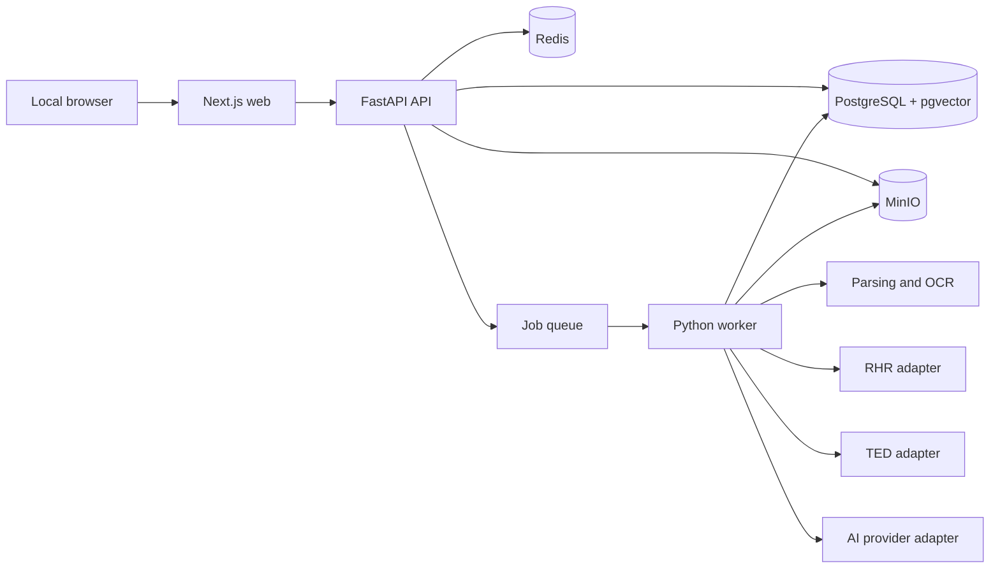

# EventNexus Hanke Keskond

Local-first, AI-assisted procurement intelligence and tender preparation workspace for **Eventnexus OÜ**.

> **Status:** Phase 0 research and policy documentation complete; application implementation has not started  
> **Next implementation task:** `S1-T01 — Create repository skeleton`  
> **Primary market:** Estonia  
> **Default product language:** Estonian (`et-EE`)  
> **Tender languages:** Estonian and English, with original-language preservation  
> **Deployment:** Self-hosted Docker environment on an Eventnexus-controlled workstation or server  
> **External AI:** Google Gemini through a policy-gated provider adapter

## 1. Purpose

EventNexus Hanke Keskond is intended to help Eventnexus OÜ:

- discover relevant Estonian and EU IT procurement opportunities;
- preserve source notices, documents, amendments, and versions;
- assess eligibility, strategic fit, capacity, evidence, and risk;
- extract and review tender requirements with source citations;
- manage a traceable compliance matrix;
- conduct bounded, source-grounded research;
- draft proposal content from approved company evidence;
- coordinate technical, commercial, legal, security, and management review;
- generate a deterministic submission package, manifest, and checklist;
- record human submission evidence and later outcomes;
- retain an auditable history of material decisions.

The product assists people. It does not replace procurement, legal, security, financial, or authorized-signatory responsibility.

## 2. Non-negotiable MVP boundaries

The MVP must not:

- autonomously decide final participation;
- autonomously approve binding claims, prices, declarations, or commitments;
- log in to RHR or another portal on behalf of a user;
- bypass authentication, CAPTCHA, rate limits, or portal controls;
- store ID-card PINs, Smart-ID or Mobile-ID secrets, private signing keys, portal passwords, or reusable identity credentials;
- sign, submit, withdraw, or email a binding tender response automatically;
- invent company references, staff experience, certifications, financial data, customers, prices, or compliance statements;
- describe Gemini processing as local or fully offline;
- expose restricted content to external AI without an approved policy path;
- use undocumented RHR behavior as a production contract;
- treat model prose as an authorization or workflow transition.

An authorized human remains responsible for the final participation decision, commercial terms, declarations, package approval, signature, and official submission.

## 3. Read before implementation

Coding agents and human contributors must read [`AGENTS.md`](AGENTS.md) completely before changing the repository.

| Document | Authority |
|---|---|
| [`TASKS.md`](TASKS.md) | Executable backlog, dependencies, acceptance criteria, milestone gates, and task status |
| [`AGENTS.md`](AGENTS.md) | Engineering workflow, mandatory document map, security rules, architecture boundaries, tests, and Definition of Done |
| [`docs/product/PRODUCT_REQUIREMENTS.md`](docs/product/PRODUCT_REQUIREMENTS.md) | Users, outcomes, MVP scope, language requirements, and product behavior |
| [`docs/product/COMPANY_PROFILE_REQUIREMENTS.md`](docs/product/COMPANY_PROFILE_REQUIREMENTS.md) | Company facts, evidence, validity, sensitivity, preferences, capacity, and derived values |
| [`docs/product/TENDER_LIFECYCLE.md`](docs/product/TENDER_LIFECYCLE.md) | Authoritative opportunity and tender-workspace state machines |
| [`docs/product/PILOT_SUCCESS_METRICS.md`](docs/product/PILOT_SUCCESS_METRICS.md) | Pilot metrics, formulas, targets, and evaluation mapping |
| [`docs/product/PHASE_0_READINESS_REVIEW.md`](docs/product/PHASE_0_READINESS_REVIEW.md) | Phase 0 decisions, remaining approvals, deferred decisions, and entry conditions |
| [`docs/integrations/RHR_DISCOVERY.md`](docs/integrations/RHR_DISCOVERY.md) | Permitted MVP RHR ingestion path and prohibited assumptions |
| [`docs/adr/ADR-001-rhr-ingestion-strategy.md`](docs/adr/ADR-001-rhr-ingestion-strategy.md) | Accepted initial RHR architecture decision |
| [`docs/integrations/TED_DISCOVERY.md`](docs/integrations/TED_DISCOVERY.md) | TED Search API v3 contract, queries, pagination, mapping, and replay |
| [`docs/integrations/SOURCE_FRESHNESS_POLICY.md`](docs/integrations/SOURCE_FRESHNESS_POLICY.md) | Polling, backoff, source outage, cursor recovery, amendments, and freshness |
| [`docs/security/GEMINI_DATA_POLICY.md`](docs/security/GEMINI_DATA_POLICY.md) | Gemini account, data use, feature, retention, and production enablement policy |
| [`docs/security/DOCUMENT_CLASSIFICATION_POLICY.md`](docs/security/DOCUMENT_CLASSIFICATION_POLICY.md) | Data classifications and permitted local/external processing |
| [`docs/security/AI_THREAT_MODEL.md`](docs/security/AI_THREAT_MODEL.md) | AI threats, controls, residual risks, and security-test mapping |
| [`docs/security/AI_COST_POLICY.md`](docs/security/AI_COST_POLICY.md) | AI budgets, warnings, hard limits, approvals, and emergency stop |
| [`docs/procurement/SUBMISSION_POLICY.md`](docs/procurement/SUBMISSION_POLICY.md) | Human submission boundary, evidence, and package handoff |
| [`docs/integrations/RHR_SUBMISSION_INTEGRATION_DISCOVERY.md`](docs/integrations/RHR_SUBMISSION_INTEGRATION_DISCOVERY.md) | Current `UNSUPPORTED_FOR_MVP` submission-integration conclusion |
| [`docs/legal/LEGAL_REVIEW_CHECKPOINTS.md`](docs/legal/LEGAL_REVIEW_CHECKPOINTS.md) | Required legal, procurement, privacy, security, commercial, and signatory review |

Do not implement a governed area from this README alone. The domain-specific document is authoritative.

## 4. Current project state

Phase 0 tasks `S0-T01` through `S0-T15` are complete as research and documentation work.

The repository currently contains:

- product requirements and lifecycle definitions;
- company-profile and evidence requirements;
- RHR and TED discovery decisions;
- source freshness and synchronization policy;
- Gemini data-processing policy;
- document classification policy;
- AI threat and cost policies;
- human-controlled submission policy;
- legal and review checkpoints;
- sanitized offline RHR and TED fixtures;
- the complete implementation backlog.

No application, Docker stack, database schema, CI pipeline, or executable product code exists yet. Those begin in Phase 1.

### 4.1 Formal M0 approvals

Completed research tasks are not the same as organizational approval. The current M0 approval status remains in [`TASKS.md`](TASKS.md) and [`PHASE_0_READINESS_REVIEW.md`](docs/product/PHASE_0_READINESS_REVIEW.md).

Repository scaffolding and other reversible, secret-free Phase 1 foundation work may proceed while approval records are being finalized. Do not enable real-data Gemini processing, broader RHR automation, production source synchronization, or submission-related automation until the relevant policy and decision owners have approved them.

## 5. Users and authority

Canonical role behavior is defined in the product requirements and lifecycle documents.

| Role | Core authority |
|---|---|
| `BID_LEAD` | Daily opportunity triage, analysis coordination, workspace management, assignments, and readiness preparation |
| `AUTHORIZED_BUSINESS_DECISION_MAKER` | Final GO/NO-GO, binding commercial risk, declarations, and exact package approval |
| `AUTHORIZED_SUBMITTER` | Human submission through the official channel and submission-evidence recording |
| `TECHNICAL_REVIEWER` | Technical feasibility, architecture, staffing, delivery, and technical claim review |
| `COMMERCIAL_REVIEWER` | Pricing, margin, guarantees, payment terms, and financial exposure review |
| `LEGAL_COMPLIANCE_REVIEWER` | Legal, contractual, eligibility, exclusion, and regulatory review |
| `SECURITY_PRIVACY_REVIEWER` | Security, privacy, data location, restricted data, and external-AI review |
| `CONTRIBUTOR` | Assigned drafting and evidence work without approval authority |
| `SYSTEM_ADMIN` | Local system operation and configuration without implied business approval authority |
| `AUDITOR` | Permission-scoped read-only review and reporting |

A small company may assign several roles to one person, but every protected action must record which authority was exercised.

## 6. Authoritative lifecycle summary

The product has two separate state machines. Exact transitions, permissions, gates, and invalidation behavior are defined in [`TENDER_LIFECYCLE.md`](docs/product/TENDER_LIFECYCLE.md).

### 6.1 Opportunity lifecycle

```text
DISCOVERED
TRIAGE_REQUIRED
ANALYSIS_IN_PROGRESS
NEEDS_MORE_INFORMATION
GO
NO_GO
WATCHING
CANCELLED_BY_BUYER
ARCHIVED
```

Only an authorized human can record final `GO` or `NO_GO`. AI may recommend a decision but cannot perform it.

### 6.2 Tender workspace lifecycle

```text
DRAFT_INTAKE
SOURCE_REVIEW
REQUIREMENT_REVIEW
PLANNING
DRAFTING
INTERNAL_REVIEW
CHANGES_REQUIRED
READY_FOR_APPROVAL
APPROVED_FOR_EXPORT
PACKAGE_GENERATED
APPROVED_FOR_SUBMISSION
SUBMITTED
SUBMISSION_FAILED
WITHDRAWN
CLARIFICATION
AWARDED
NOT_AWARDED
CANCELLED
CLOSED
```

Source amendments invalidate only the affected analysis, content, pricing, readiness checks, or approvals according to deterministic rules. Historical records remain immutable and auditable.

## 7. Source strategy

### 7.1 TED

The official TED Search API v3 is the selected primary automated opportunity-discovery source for relevant published EU notices.

Production endpoint:

```text
POST https://api.ted.europa.eu/v3/notices/search
```

The implementation must follow [`TED_DISCOVERY.md`](docs/integrations/TED_DISCOVERY.md), use durable cursor/replay behavior, preserve raw source versions, and validate configured query syntax and fields against the current production contract.

### 7.2 RHR

The selected MVP strategy is:

1. use TED for documented automated discovery where notices are available there;
2. support user-directed import of a known public RHR notice URL or identifier;
3. support manual notice and document import as a first-class fallback;
4. optionally retrieve explicitly public rendered RHR notice content through a bounded, allowlisted adapter;
5. preserve raw source identity and immutable versions;
6. do not implement undocumented bulk RHR search, sequential ID crawling, authenticated scraping, or supplier submission automation.

The public rendered notice pattern observed during discovery is:

```text
https://riigihanked.riik.ee/rhr/api/public/v1/notice/{noticeId}/html
```

This observed path is not permission to assume an undocumented bulk-search API.

### 7.3 Fixtures

Offline source tests use:

```text
fixtures/rhr/
fixtures/ted/
```

Read each fixture directory's `README.md` before using its data. Fixtures are test contracts, not live API schemas, production business data, or proof of current legal permission for a broader integration.

## 8. Local-first architecture



Expected implementation:

| Area | Baseline |
|---|---|
| Web | Next.js, React, TypeScript strict mode |
| API | Python 3.12, FastAPI, Pydantic |
| Worker | Celery or Dramatiq, selected through an ADR |
| Database | PostgreSQL with pgvector |
| Queue/cache | Redis |
| Object storage | MinIO |
| AI | Official Google Gen AI SDK behind an internal provider interface |
| Parsing | Local PDF, DOCX, XLSX, HTML, XML, TXT, and image pipeline |
| OCR | Tesseract with Estonian and English language packs |
| Export | Versioned DOCX templates and controlled local PDF conversion |
| Testing | Pytest, Vitest, Playwright, Testcontainers, fixture-based contracts |
| Quality | Ruff, mypy, ESLint, Prettier |

Material technology changes require an ADR.

## 9. Architecture invariants

- domain logic does not import FastAPI, SQLAlchemy, Google SDKs, Redis, MinIO, or source HTTP clients;
- external systems use ports and adapters;
- original files and raw source versions are immutable;
- changed content creates a new version;
- citations identify an immutable source version and location;
- generated company claims require approved evidence or explicit unresolved status;
- approvals identify an exact version and content hash;
- source changes can invalidate dependent approvals without deleting history;
- deadlines preserve original text, source timezone, parsed UTC value, and parsing confidence;
- money uses decimal values with currency and VAT basis;
- AI output cannot directly mutate approved business records;
- external actions are permission-checked, validated, confirmed, and audited.

## 10. AI and data policy

The application runs locally, but Gemini is external processing.

Mandatory behavior:

- production free-tier use is prohibited by project policy;
- production requires a dedicated Eventnexus-controlled paid project;
- unknown classification means no external AI;
- `RESTRICTED_NO_EXTERNAL_AI` is always local-only;
- `CONFIDENTIAL` and `PERSONAL_DATA` are denied by default;
- local parsing, OCR, chunking, retrieval, and deterministic checks occur before any external call;
- only minimum permitted excerpts may be sent;
- every invocation is policy-gated, schema-validated, cost-limited, and auditable;
- prompts and model identifiers are versioned;
- paid live APIs are mocked in default tests;
- model output remains a draft or recommendation until human review.

Initial pilot hard limits are defined in [`AI_COST_POLICY.md`](docs/security/AI_COST_POLICY.md), including per-call, workflow, workspace, daily, and monthly bounds.

## 11. Planned repository structure

The repository skeleton created by `S1-T01` must preserve the Phase 0 documentation and fixture paths while adding implementation directories.

```text
.
├── README.md
├── AGENTS.md
├── TASKS.md
├── .editorconfig
├── .gitattributes
├── .gitignore
├── .env.example                 # added in S1-T10
├── docker-compose.yml           # added in S1-T06
├── docker-compose.dev.yml       # added in S1-T08
├── Makefile                     # added in S1-T09
├── apps/
│   ├── web/
│   ├── api/
│   └── worker/
├── packages/
│   ├── contracts/
│   ├── ui/
│   └── config/
├── services/
│   ├── document-converter/
│   └── ocr/
├── infrastructure/
│   ├── docker/
│   ├── observability/
│   └── backup/
├── templates/
│   ├── proposals/
│   └── exports/
├── prompts/
│   ├── extraction/
│   ├── matching/
│   ├── research/
│   ├── drafting/
│   └── review/
├── docs/
│   ├── product/
│   ├── integrations/
│   ├── security/
│   ├── procurement/
│   ├── legal/
│   ├── architecture/
│   ├── adr/
│   ├── api/
│   └── runbooks/
├── fixtures/
│   ├── rhr/
│   └── ted/
├── tests/
│   ├── integration/
│   ├── e2e/
│   ├── security/
│   └── generated-fixtures/
└── scripts/
```

No open-source license has been selected. Do not add a license or claim open-source permissions without an explicit owner decision.

## 12. Local development starting point

Clone the repository:

```bash
git clone https://github.com/pikkst/Eventnexus-hanke-keskond.git
cd Eventnexus-hanke-keskond
```

Before the first change:

1. read `README.md`, `AGENTS.md`, and the active task in `TASKS.md`;
2. read `docs/product/PHASE_0_READINESS_REVIEW.md`;
3. select the canonical documents required by the task using the matrix in `AGENTS.md`;
4. confirm that no real secrets, personal data, or tender documents are being added;
5. start with `S1-T01 — Create repository skeleton`;
6. use focused conventional commits and update `TASKS.md` only after acceptance criteria are verified.

At the current repository state, commands such as `make test` do not exist yet. Use `docker compose up --build` for the base stack or `docker compose -f docker-compose.yml -f docker-compose.dev.yml up --build` for development mode with hot reload. See `docs/runbooks/DEVELOPMENT.md` for shell-specific instructions.

## 13. Planned root commands

Later Phase 1 tasks will provide Windows-friendly and Bash-compatible entrypoints for:

```text
bootstrap
dev
stop
logs
format-check
lint
typecheck
test
integration
e2e
migrate
seed
backup
restore
```

Destructive operations must require explicit confirmation.

## 14. Definition of MVP done

The MVP is not complete until:

- a clean machine can start the system through documented Docker commands;
- the core UI is usable in Estonian;
- authentication, authorization, and audit controls pass negative tests;
- the approved RHR path, TED adapter, and manual import work;
- source and document versions remain immutable and citeable;
- parsing and OCR produce visible quality information;
- matching and GO/NO-GO decisions are explainable and human-controlled;
- requirements and the compliance matrix are reviewable and source-grounded;
- Gemini use is policy-gated, schema-validated, cost-limited, and audited;
- proposal drafts use approved evidence and expose assumptions;
- pricing calculations are deterministic and human-approved;
- readiness checks block incomplete or stale packages;
- DOCX/PDF export, manifest, package hash, and checklist work;
- submission remains human-controlled;
- backup and restore are tested;
- security, AI-quality, and pilot gates pass;
- required user, administrator, security, integration, and recovery documentation exists.

The detailed release gate is maintained in [`TASKS.md`](TASKS.md).

## 15. Legal and operational notice

This repository does not provide legal advice. Procurement requirements, laws, official notices, source interfaces, deadlines, data-processing terms, and submission rules are time-sensitive and must be rechecked against current official sources before production use.

## 16. License

No open-source license has been selected. Until an explicit license is added, do not assume permission to copy, redistribute, sublicense, or commercially reuse the repository contents beyond the repository owner's authorization.
