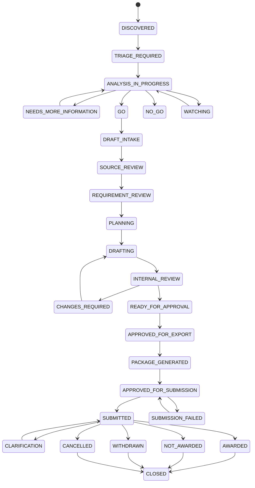

# EventNexus Hanke Keskond — MVP Tender Lifecycle

**Document ID:** PRD-003  
**Task:** S0-T03  
**Status:** Complete  
**Last updated:** 2026-08-04

## 1. Purpose

This document defines the authoritative lifecycle for procurement opportunities and tender workspaces in the MVP. The lifecycle is deterministic, versioned, permission-controlled, and auditable. AI may recommend actions or identify risks, but no lifecycle transition may depend only on model output.

## 2. Domain separation

The product has two related state machines:

1. **Opportunity lifecycle** — discovery, qualification, and participation decision.
2. **Tender workspace lifecycle** — preparation, review, approval, export, human submission, and outcome tracking.

A source notice may exist without a workspace. A workspace is created only after a human-controlled decision or explicit manual action.

## 3. Roles

| Role | Core authority |
|---|---|
| `BID_LEAD` | Triage opportunities, coordinate analysis, request reviews, manage workspace readiness |
| `AUTHORIZED_BUSINESS_DECISION_MAKER` | Record final GO/NO-GO, approve binding commercial terms and final package |
| `AUTHORIZED_SUBMITTER` | Submit through the official channel and record submission evidence |
| `TECHNICAL_REVIEWER` | Review technical requirements, claims, feasibility, and commitments |
| `COMMERCIAL_REVIEWER` | Review pricing, margin, financial exposure, guarantees, and payment terms |
| `LEGAL_COMPLIANCE_REVIEWER` | Review declarations, exclusions, contractual and regulatory risks |
| `SECURITY_PRIVACY_REVIEWER` | Review security, data protection, external AI, and restricted-data handling |
| `CONTRIBUTOR` | Draft and edit assigned content without approval authority |
| `SYSTEM_ADMIN` | Operate the system; no implied authority to approve business content |

A person may hold multiple roles in a small organization, but the audit event must record which authority was exercised.

## 4. Opportunity states

| State | Meaning |
|---|---|
| `DISCOVERED` | Imported from RHR, TED, or manual source; not yet triaged |
| `TRIAGE_REQUIRED` | Basic normalization completed and human review is required |
| `ANALYSIS_IN_PROGRESS` | Fit, eligibility, source, and timing analysis is underway |
| `NEEDS_MORE_INFORMATION` | Decision is blocked by missing facts, documents, capacity, partner, or clarification |
| `GO` | Authorized human has approved bid preparation for selected lot(s) |
| `NO_GO` | Authorized human has declined participation with rationale |
| `WATCHING` | No immediate bid action; source changes or future deadlines are monitored |
| `CANCELLED_BY_BUYER` | Source indicates cancellation or procedure termination |
| `ARCHIVED` | Retained for history with no active work |

### 4.1 Opportunity transitions

| From | To | Minimum actor | Required gate |
|---|---|---|---|
| `DISCOVERED` | `TRIAGE_REQUIRED` | System or Bid Lead | Source identity and raw payload preserved |
| `TRIAGE_REQUIRED` | `ANALYSIS_IN_PROGRESS` | Bid Lead | Owner assigned; deadline parsed or marked unknown |
| `ANALYSIS_IN_PROGRESS` | `NEEDS_MORE_INFORMATION` | Bid Lead | Missing inputs listed |
| `ANALYSIS_IN_PROGRESS` | `GO` | Authorized Business Decision-Maker | Fit assessment reviewed; hard disqualifiers resolved; selected lots explicit |
| `ANALYSIS_IN_PROGRESS` | `NO_GO` | Authorized Business Decision-Maker | Reason recorded |
| `NEEDS_MORE_INFORMATION` | `ANALYSIS_IN_PROGRESS` | Bid Lead | Blocking input added or explicitly waived by authorized role |
| `GO` | `ANALYSIS_IN_PROGRESS` | Authorized Business Decision-Maker | Material source amendment, capacity change, or decision reconsideration |
| Any active state | `CANCELLED_BY_BUYER` | System with human confirmation or Bid Lead | Authoritative source evidence linked |
| `NO_GO`, `CANCELLED_BY_BUYER` | `ARCHIVED` | Bid Lead | Retention metadata recorded |
| `WATCHING` | `ANALYSIS_IN_PROGRESS` | Bid Lead | Triggering change or manual reason recorded |

AI may recommend `GO`, `NO_GO`, or `NEEDS_MORE_INFORMATION`, but only an authorized user can perform the transition.

## 5. Tender workspace states

| State | Meaning |
|---|---|
| `DRAFT_INTAKE` | Workspace created; source snapshot and selected lots being confirmed |
| `SOURCE_REVIEW` | Tender documents and versions are being collected and checked |
| `REQUIREMENT_REVIEW` | Candidate requirements are being reviewed and approved |
| `PLANNING` | Compliance, ownership, research, proposal structure, and bid plan are being prepared |
| `DRAFTING` | Technical, administrative, and commercial content is being drafted |
| `INTERNAL_REVIEW` | Assigned reviewers are checking exact versions |
| `CHANGES_REQUIRED` | Review findings require rework |
| `READY_FOR_APPROVAL` | Deterministic readiness checks pass; final approvals are pending |
| `APPROVED_FOR_EXPORT` | Content and pricing approvals refer to exact versions |
| `PACKAGE_GENERATED` | Immutable package snapshot, manifest, hash, and checklist exist |
| `APPROVED_FOR_SUBMISSION` | Authorized decision-maker approved the exact package hash |
| `SUBMITTED` | Authorized person recorded successful official submission evidence |
| `SUBMISSION_FAILED` | Human submission attempt failed or official receipt is unavailable |
| `WITHDRAWN` | Authorized person withdrew the bid before the applicable deadline |
| `CLARIFICATION` | Buyer clarification or additional information response is active |
| `AWARDED` | Official result indicates award to Eventnexus OÜ or its consortium |
| `NOT_AWARDED` | Official result indicates another outcome |
| `CANCELLED` | Procedure or relevant lot was cancelled |
| `CLOSED` | Final outcome recorded and workspace retained for audit/learning |

## 6. Workspace transition gates

### 6.1 Intake to analysis

`DRAFT_INTAKE -> SOURCE_REVIEW`

Required:

- opportunity/source identity or manual source note;
- selected lot(s);
- authoritative source links;
- source version snapshot;
- deadline with original text and timezone, or visible `UNKNOWN`;
- workspace owner.

`SOURCE_REVIEW -> REQUIREMENT_REVIEW`

Required:

- required source files imported or missing files listed;
- parse/OCR status visible;
- failed or inaccessible documents identified;
- amendment/version history checked.

### 6.2 Analysis to drafting

`REQUIREMENT_REVIEW -> PLANNING`

Required:

- mandatory candidate requirements reviewed;
- every approved requirement has a source citation;
- unresolved conflicts remain visible;
- qualification and requested evidence categories reviewed.

`PLANNING -> DRAFTING`

Required:

- requirement owners assigned;
- compliance items created;
- proposal outline reviewed;
- research tasks bounded;
- approved company evidence identified;
- pricing owner assigned.

### 6.3 Drafting and review

`DRAFTING -> INTERNAL_REVIEW`

Required:

- mandatory sections have a reviewable version;
- unsupported claims and placeholders are visible;
- citations and requirement links exist where required;
- pricing status is visible.

`INTERNAL_REVIEW -> CHANGES_REQUIRED`

Authorized actors: assigned reviewers or Bid Lead. Review findings and severity are required.

`CHANGES_REQUIRED -> DRAFTING`

Required: change scope and owner recorded.

`INTERNAL_REVIEW -> READY_FOR_APPROVAL`

Required:

- no unresolved critical review finding;
- all mandatory requirements are compliant, explicitly non-compliant, or formally blocked;
- no hidden placeholder;
- final pricing scenario selected;
- source freshness check passes;
- required legal/security/commercial reviews completed.

### 6.4 Approval and export

`READY_FOR_APPROVAL -> APPROVED_FOR_EXPORT`

Required approvals:

- content approval;
- pricing approval;
- required declaration approvals;
- approved company evidence versions;
- authorized business approval.

Every approval stores entity version, content hash, actor, role, time, and rationale where required.

`APPROVED_FOR_EXPORT -> PACKAGE_GENERATED`

Required:

- deterministic export renderer succeeds;
- manifest and validation report generated;
- exact package SHA-256 stored;
- no unresolved hard readiness error.

`PACKAGE_GENERATED -> APPROVED_FOR_SUBMISSION`

Minimum actor: Authorized Business Decision-Maker. The exact package hash, selected lots, price version, source version, and checklist must be visible.

### 6.5 Human submission

`APPROVED_FOR_SUBMISSION -> SUBMITTED`

Minimum actor: Authorized Submitter.

Required evidence:

- official channel;
- exact package hash;
- submission timestamp;
- submitter identity;
- official reference or receipt when issued;
- receipt file/screenshot or explanation when unavailable.

The product must not perform this transition merely because a package was generated or a browser link was opened.

`APPROVED_FOR_SUBMISSION -> SUBMISSION_FAILED`

Required: failure reason, time, affected deadline, and next action.

`SUBMISSION_FAILED -> APPROVED_FOR_SUBMISSION`

Required: package and approvals still valid; otherwise transition back to the earliest invalidated state.

### 6.6 Post-submission states

`SUBMITTED -> CLARIFICATION` when an official clarification request is received.

`CLARIFICATION -> SUBMITTED` when the response is submitted and evidence recorded.

`SUBMITTED -> WITHDRAWN` only by an authorized role and only with official withdrawal evidence.

`SUBMITTED`, `CLARIFICATION` -> `AWARDED`, `NOT_AWARDED`, or `CANCELLED` based on authoritative source evidence.

Terminal outcome states may transition to `CLOSED` after the outcome, documents, and retrospective fields are recorded.

## 7. Amendment and invalidation rules

A new source version must be compared deterministically before any AI summary. Material changes can invalidate downstream data.

| Changed source element | Minimum invalidation |
|---|---|
| Submission deadline | Deadline checks, reminders, readiness, submission approval |
| Scope or lot structure | Fit decision, requirements, compliance, proposal, pricing, approvals |
| Eligibility/exclusion criteria | GO decision, evidence mapping, declarations, readiness |
| Evaluation criteria or weights | bid strategy, proposal plan, pricing strategy, readiness |
| Required form/template | mapped content, export, package approval |
| Contract terms | legal/commercial review, pricing, risk acceptance, final approval |
| Attachment added/replaced | parsing, requirement coverage, citations, dependent drafts and approvals |
| Buyer clarification | affected requirements, claims, risks, drafts, and approvals |
| Cancellation | active preparation and submission states blocked; workspace moves to `CANCELLED` after verification |

Invalidation must retain historical approvals as inactive records; it must never delete the audit history.

## 8. Clarification workflow

Clarification questions and responses are versioned records linked to source requirements. AI may draft a question, but a human reviews and sends it manually in the MVP. A response can reopen requirement review, GO/NO-GO, pricing, or approval states depending on impact.

## 9. Withdrawal rules

Withdrawal requires:

- authorized actor;
- reason;
- official channel confirmation or evidence;
- package/submission reference;
- timestamp;
- impact note.

AI cannot recommend and execute withdrawal as a single action.

## 10. Terminal-state semantics

`AWARDED`, `NOT_AWARDED`, `CANCELLED`, and `WITHDRAWN` represent business outcomes, not deletion. `CLOSED` means no active operational work remains. Reopening requires an explicit reason and authorized actor, for example an appeal, corrected result, contract clarification, or data-quality correction.

## 11. Permission rules

- State transition authorization is enforced server-side.
- A system administrator has no implicit business approval authority.
- Final GO/NO-GO, pricing, package, withdrawal, and submission records require explicit human action.
- Source-driven automatic transitions may only create provisional flags or safe states; a human confirms legally or commercially material outcomes.
- Separation of duties is configurable, but the exercised role must always be recorded.

## 12. Audit requirements

Every transition records:

```text
transition_id
entity_type
entity_id
from_state
to_state
actor_id
actor_role
reason
source_version_ids
content_hashes
approval_ids
validation_result_id
occurred_at
correlation_id
safe_metadata
```

Rejected transition attempts should be logged when security- or approval-relevant without storing secrets.

## 13. State diagram



## 14. Acceptance traceability

- **State diagram exists:** Section 13.
- **Protected transitions identify authorized roles:** Sections 3, 4.1, 6, and 11.
- **Source changes invalidate affected analysis and approvals:** Section 7.
- **No transition depends only on model output:** Sections 1, 4.1, 6.5, 8, 9, and 11.
